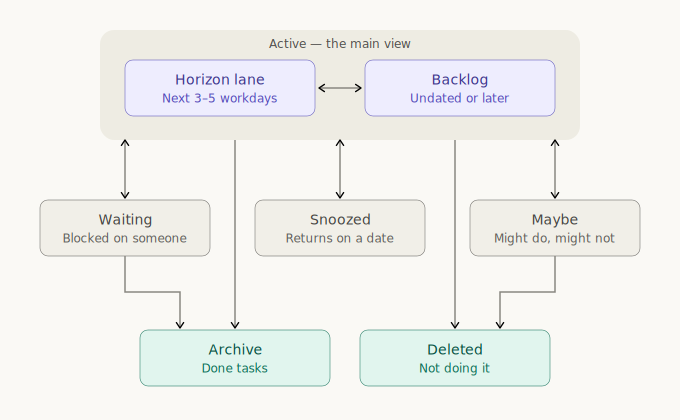

# Horizon

A lightweight, single-user task planner. Upcoming tasks live on the
**horizon** — a lane for each of the next 3–5 workdays — plus a backlog
for everything undated or due later.


## Concepts

A task lives in one of a handful of places:

- **Horizon** — lanes holding the cards of the tasks planned for the next
  3–5 workdays.
- **Backlog** — unscheduled tasks and tasks with a due date farther in the
  future.
- **Snoozed** — tasks that are currently not actionable. Snoozed tasks
  resurface in the backlog after a configurable duration.
- **Waiting** — tasks that are waiting for a response from someone else.
- **Maybe** — the dump for things you haven't committed to and might never
  do; they only come back into view when you pull them in.
- **Deleted** — tasks that you decided not to do at all.
- **Archive** — holds Done tasks.



Horizon is deliberately minimal: one person, one board, one SQLite file
(`tasks.db`). There are no accounts, teams, epics, statuses, or custom
fields. Interactions are optimized for speed: drag-and-drop scheduling,
quick-date buttons, single-key shortcuts, keyboard-friendly modals.

## Getting started

### Windows: double-click app

Horizon is one self-contained exe, nothing else to install. Pick a folder
for it — that folder is also where your tasks will live, in a `tasks.db`
SQLite file created next to the exe. Open PowerShell in that folder and run:

```powershell
Invoke-WebRequest https://github.com/dnswlt/horizon/releases/latest/download/Horizon.exe -OutFile Horizon.exe
```

```powershell
.\Horizon.exe
```

Then pin it to the taskbar.

Why PowerShell and not the browser? Managed (corporate) environments often
block unsigned exe downloads in the browser, or show a SmartScreen warning
on first launch (**More info → Run anyway**) — the PowerShell route avoids
both. If your environment doesn't mind, downloading `Horizon.exe` from the
[Releases page](https://github.com/dnswlt/horizon/releases) works just as
well.

Notes:

- Updating is re-running the download command in the same folder (or
  replacing the exe); `tasks.db` stays where it is. Databases created by
  older (Python-based) versions are upgraded automatically on first launch.

### Browser mode

The same binary is an ordinary local web server:

```bash
Horizon.exe --serve          # then open http://127.0.0.1:8063
Horizon.exe --serve --port 9000
```

## Development

You need [Rust](https://rustup.rs/) (stable, MSVC toolchain on Windows).

```bash
cargo run -- --serve   # dev server; frontend edits are picked up on reload
cargo run              # dev build of the windowed app
make test              # backend (cargo test) + frontend (npm test)
```

Debug builds serve `static/` from disk and keep `tasks.db` in the repo root;
release builds embed the frontend into the exe and keep data next to the exe.

### Releasing

Releases are built automatically by
[.github/workflows/release.yml](.github/workflows/release.yml) whenever a
`v*.*.*` tag is pushed. A local release build is just:

```bash
cargo build --release   # -> target/release/Horizon.exe
```
